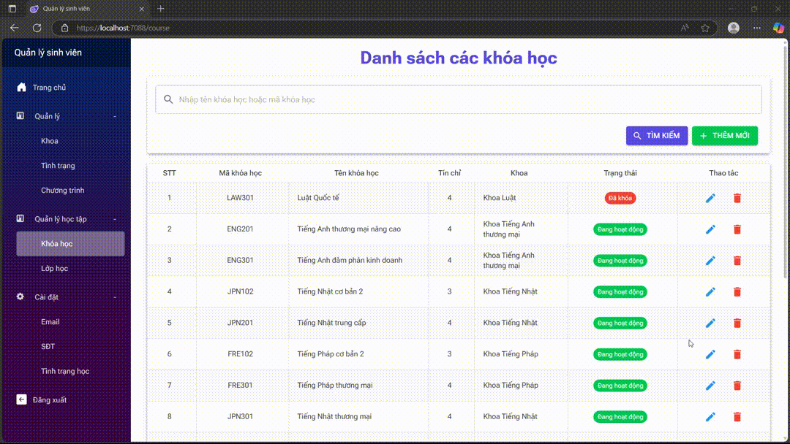
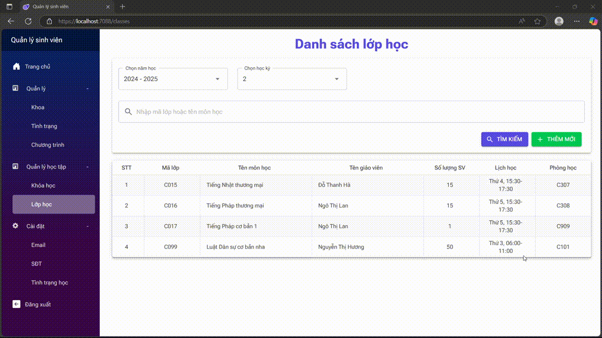

# [FE] Student Management

## Cấu trúc source code
```
student_management_fe/
│
├── Program.cs              # The entry point of the application
│
├── App.razor               # Root component, sets up routing and layout usage
│
├── Views/                  # Contains all UI components and page layouts
│   ├── Pages/              # Holds the core pages of the application
│   │   ├── AcademicManagements
│   │   │
│   │   ├── Managements
│   │   │
│   │   ├── Settings
│   │   │
│   │   ├── Home.razor
│   │   │
│   │   └── Login.razor
│   │   
│   ├── Layout/             # Contains the main layout components
│   │   
│   └── Shared/             # Contains shared UI components used across pages
│
├── Models/                 # Data models and DTOs
│
├── Services/               # Business logic and API communication
│
├── Authentication/         # User authentication and authorization logic
│
├── Extensions/             # Extension methods for adding functionality 
│
├── Helpers/                # Helper classes
│  
├── Resources/              # Localization resources
│
└── wwwroot/                # Static assets: images, CSS, JS
```

## Kiến trúc


## Hướng dẫn cài đặt & chạy chương trình
- Sử dụng Visual Studio 2022
- Cài gói `ASP.NET and web development`
- Cần chạy source Backend trước khi chạy source này
- Chạy source bằng cách nhấn `F5` hoặc `Ctrl + F5`

## Lưu ý
- Tài khoản mặc định để log in là:
    ```
    username: admin
    password: admin
    ```
- Link trang web: `https://localhost:7088`

## Hình ảnh các chức năng
### Thêm sinh viên


### Xóa sinh viên


### Cập nhật thông tin sinh viên


### Tìm kiếm sinh viên


### Đổi tên & thêm mới khoa, chương trình, tình trạng sinh viên


### Tìm theo khoa (filter theo khoa)


### Export từ Excel / Json


### Import từ Excel / Json


### Logging


### Xuất bảng điểm


### Quản lý khóa học


### Quản lý lớp học


### Đa ngôn ngữ


## Các Business Rules
### MSSV phải là duy nhất
- MSSV là khóa chính (PK) trong bảng students
- MSSV được tạo tự động khi thêm sinh viên, không cho sửa MSSV
- Từ 2 điều trên, đảm bảo MSSV là duy nhất

### Email phải thuộc một tên miền nhất định và có thể cấu hình động (configurable)


### Số điện thoại phải có định dạng hợp lệ theo quốc gia (configurable) 


### Tình trạng sinh viên chỉ có thể thay đổi theo một số quy tắc (configurable)


## The Broken Window Theory & The Boy Scout Rule
- File: <a href=./docs/ex03/ex03_slide.pdf>ex03_slide.pdf</a>

## Unit Test
- File: <a href=./docs/ex04/ex04_slide.pdf>ex04_slide.pdf</a>
